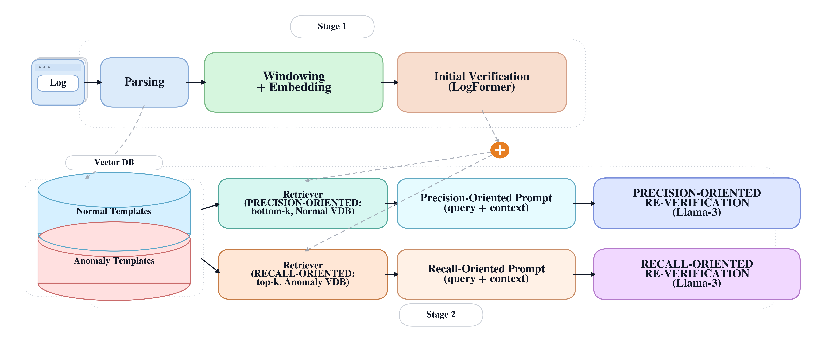

<div align="center">

# 🛡️ LogRAIL

### A Retrieval-Augmented LLM Reverification Layer for Log Anomaly Detection

<p>
  <a href="https://doi.org/10.1109/ACCESS.2026.3688834"></a>
  <a href="https://doi.org/10.1109/ACCESS.2026.3688834"></a>
  <a href="https://doi.org/10.5281/zenodo.19118648"></a>
  
</p>

<p>
  
  
  
  
  
  
</p>

<p><i>Published in <b>IEEE Access</b>, vol. 14, pp. 65899–65911, 2026 &nbsp;·&nbsp; <a href="https://ieeexplore.ieee.org/document/11499390">📄 Read on IEEE Xplore</a></i></p>

</div>

---

## 📊 Key Results (real AOSP Android logs)

| Method | Precision | Recall | **F1** |
|---|:---:|:---:|:---:|
| DeepLog | 0.8420 | 0.8870 | 0.8639 |
| LogBERT | 0.8680 | 0.9040 | 0.8856 |
| Stage 1 (LogFormer) | 0.8932 | 0.9246 | 0.9086 |
| LogRAG | 0.9360 | 0.7880 | 0.8550 |
| **LogRAIL (precision)** | **0.9273** | 0.9273 | **0.9273** |
| **LogRAIL (recall)** | 0.9102 | **0.9398** | **0.9248** |

📈 F1 improves **0.9086 → 0.9273** over the single-stage baseline, outperforming DeepLog, LogBERT, and LogRAG.

---

This repository provides a two-stage log anomaly detection pipeline:
1) Stage-1 (LogFormer) scores all windows.
2) Stage-2 re-verifies near-threshold windows via VDB + LLM in two modes:
   - Precision-oriented (Normal VDB, bottom-k)
   - Recall-oriented (Anomaly VDB, top-k)

The steps below match the current codebase and defaults.



## Pipeline Overview (Box Diagram)
```text
[Raw Logs / Labeled CSV]
          |
          v
[Preprocess: windowing + embeddings]
          |
          v
[Stage-1 LogFormer]
  |                |
  | (all windows)  |  -> scores + pred/prob
  v                v
[Window templates] [Stage-1 preds]
          |                |
          +--------+-------+
                   v
        [Stage-2 Candidate Windows]
          |                   |
          | Precision path    | Recall path
          v                   v
[Normal VDB bottom-k]   [Anomaly VDB top-k]
          |                   |
          +--------+----------+
                   v
              [LLM decision]
                   |
                   v
             [Final anomaly]
```

## Project Structure (Core)
- `dataset/Android_new_full.csv` : Labeled log dataset (public)
- `LogFormer/preprocess/preprocess.py` : Window preprocessing -> NPZ
- `LogFormer/train_transformer.py` : Stage-1 training
- `LogFormer/sweep_threshold.py` : Threshold sweep (optional)
- `LogFormer/infer_logformer.py` : Stage-1 inference
- `rebuild_window_repr_from_split.py` : Window_id -> templates mapping
- `make_gt_csv.py` : GT CSV from NPZ (test/all)
- `build_train_vdb_templates.py` : Train-only template corpora (normal/anomaly)
- `clean_normal_templates.py` / `clean_anomaly_templates.py` : Simple corpus builders
- `postprocess/RAG_Normal.py` : Stage-2 precision mode (Normal VDB)
- `postprocess/RAG_Abnormal.py` : Stage-2 recall mode (Anomaly VDB)

## Environment
```bash
python -m venv .venv
.venv\Scripts\activate
pip install -r requirements.txt
```

## End-to-End Pipeline (Recommended)
### 1) Preprocess -> NPZ
```bash
python LogFormer/preprocess/preprocess.py ^
  --csv dataset/Android_new_full.csv ^
  --out LogFormer/npz
```

### 2) Train Stage-1 (LogFormer)
```bash
python LogFormer/train_transformer.py
```
Outputs: `LogFormer/checkpoints/best_*.pt`

### 3) (Optional) Sweep Threshold
```bash
python LogFormer/sweep_threshold.py --ckpt LogFormer/checkpoints/best_*.pt --split test
```

### 4) Stage-1 Inference
```bash
python LogFormer/infer_logformer.py ^
  --ckpt LogFormer/checkpoints/best_*.pt ^
  --out output/logformer_preds_test.csv
```

### 5) Rebuild Window Templates (align with window_id)
```bash
python rebuild_window_repr_from_split.py ^
  --src_csv dataset/Android_new_full.csv ^
  --window_size 20 --train_ratio 0.7 --val_ratio 0.15 --test_ratio 0.15 --seed 42 ^
  --format json --out output/window_repr_by_pred_info_norm.csv
```
Note: Use a separate file for anomaly mode if desired (e.g., `..._anom.csv`).

### 6) Build VDB Template Corpora (Train-only)
```bash
python build_train_vdb_templates.py ^
  --src_csv dataset/Android_new_full.csv ^
  --out_normal dataset/normal_templates_clean.csv ^
  --out_anomaly dataset/anomaly_templates_clean.csv
```

### 7) Build GT (test/all)
```bash
python make_gt_csv.py --npz_dir LogFormer/npz
```
Outputs: `output/gt_test.csv`, `output/gt_all.csv`

### 8) Stage-2 Re-verification
Precision-oriented (Normal VDB, bottom-k):
```bash
python postprocess/RAG_Normal.py
```
Recall-oriented (Anomaly VDB, top-k):
```bash
python postprocess/RAG_Abnormal.py
```
Both scripts perform evaluation by default using `output/gt_test.csv`.

## Notes
- Stage-2 scripts already print final metrics. A separate evaluator is optional.
- Ensure `window_repr_by_pred_info_*.csv` and `logformer_preds_*.csv` use the same window_id order.
- If you want validation-only ablations, see `run_stage2_ablation.py` and `summarize_stage2_ablation.py`.

## LLM (Llama 3 Instruct)
We use `meta-llama/Meta-Llama-3-8B-Instruct` for Stage-2 LLM verification.

### 1) Prerequisite
You need access to Llama 3 weights on Hugging Face. Make sure your account is approved.

### 2) Download / Cache (first run)
```bash
python - <<'PY'
from transformers import AutoTokenizer, AutoModelForCausalLM
model_name = "meta-llama/Meta-Llama-3-8B-Instruct"
tok = AutoTokenizer.from_pretrained(model_name, trust_remote_code=True)
_ = AutoModelForCausalLM.from_pretrained(
    model_name, device_map="auto", torch_dtype="auto", trust_remote_code=True
)
print("Downloaded/cached:", model_name)
PY
```

### 3) Usage in this repo
The Stage-2 scripts already load the model:
- `postprocess/RAG_Normal.py` (precision path)
- `postprocess/RAG_Abnormal.py` (recall path)

If you want to override the model:
```bash
python postprocess/RAG_Normal.py --llm_model meta-llama/Meta-Llama-3-8B-Instruct
```

## 📌 Citation

If you use LogRAIL in your research, please cite:

```bibtex
@article{choi2026lograil,
  title   = {LogRAIL: A Retrieval-Augmented LLM Reverification Layer for Log Anomaly Detection},
  author  = {Choi, Wongwang and Park, Donghee and Kim, Myeonggwan and Cho, Subin and Lee, Seonghun and Park, Jaehwa and Park, Ho-Hyun},
  journal = {IEEE Access},
  volume  = {14},
  pages   = {65899--65911},
  year    = {2026},
  doi     = {10.1109/ACCESS.2026.3688834}
}
```
